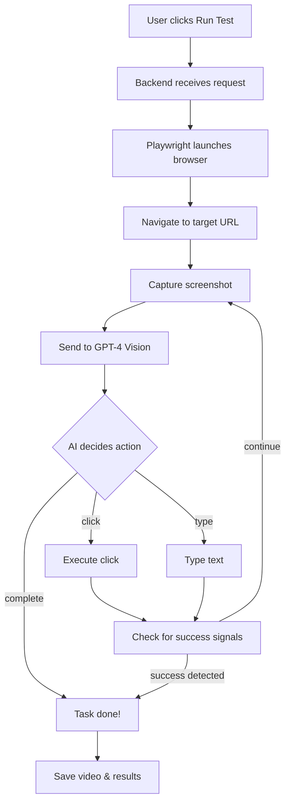

# SentinelQA Enterprise

**AI-Powered Autonomous Web Application Testing Platform**

[](https://opensource.org/licenses/MIT)
[](https://www.python.org/downloads/)
[](https://reactjs.org/)
[](https://fastapi.tiangolo.com/)

SentinelQA uses GPT-4 Vision to automatically test your web applications by analyzing screenshots and executing actions like a human tester would.

---

## 🌟 Features

| Feature | Description |
|---------|-------------|
| **AI-Powered Testing** | GPT-4 Vision analyzes screenshots and decides what actions to take |
| **Natural Language Instructions** | Write tests in plain English: "Click login, enter email, submit form" |
| **Video Recording** | Every test session is recorded and playable in the UI |
| **Smart Completion Detection** | AI detects success messages and URL changes to stop early |
| **Self-Healing Tests** | Automatically fixes broken selectors when elements change |
| **Multi-Tenant Architecture** | Organizations, projects, and team members |

---

## 🏗️ Project Structure

```
SentinelQA/
├── backend/                 # FastAPI Python backend
│   ├── server.py           # Main API server
│   ├── worker.py           # AI test worker with Playwright
│   ├── requirements.txt    # Python dependencies
│   ├── .env.example        # Environment template
│   └── videos/             # Recorded test videos
│
├── frontend/               # React frontend
│   ├── src/
│   │   ├── pages/         # React pages
│   │   ├── components/    # UI components
│   │   └── context/       # Auth context
│   ├── package.json
│   └── .env.example       # Environment template
│
├── chrome-extension/       # Browser action recorder
│   ├── manifest.json
│   ├── background/
│   ├── content/
│   └── popup/
│
├── docs/                   # Documentation
├── .github/               # GitHub templates
├── CONTRIBUTING.md        # Contribution guidelines
├── CODE_OF_CONDUCT.md     # Community standards
└── LICENSE                # MIT License
```

---

## 🚀 Quick Start

### Prerequisites

- **Python 3.10+**
- **Node.js 18+**
- **OpenAI API Key** ([Get one here](https://platform.openai.com/api-keys))

### 1. Clone Repository

```bash
git clone https://github.com/your-org/sentinelqa.git
cd sentinelqa
```

### 2. Backend Setup

```bash
# Navigate to backend
cd backend

# Create virtual environment
python -m venv venv

# Activate virtual environment
# Windows:
venv\Scripts\activate
# macOS/Linux:
source venv/bin/activate

# Install dependencies
pip install -r requirements.txt

# Install Playwright browsers
playwright install chromium

# Copy environment template
copy .env.example .env  # Windows
# cp .env.example .env  # macOS/Linux

# Edit .env and add your OpenAI API key
```

### 3. Frontend Setup

```bash
# Navigate to frontend (from project root)
cd frontend

# Install dependencies
npm install

# Copy environment template
copy .env.example .env  # Windows
# cp .env.example .env  # macOS/Linux
```

### 4. Start Development Servers

**Terminal 1 - Backend:**
```bash
cd backend
python -m uvicorn server:app --port 8000 --reload
```

**Terminal 2 - Frontend:**
```bash
cd frontend
npm start
```

### 5. Access Application

- **Frontend:** http://localhost:3000
- **Backend API:** http://localhost:8000
- **API Docs:** http://localhost:8000/docs

---

## 📖 How It Works



---

## 🧪 Running Tests

```bash
# Backend tests
cd backend
pytest

# Frontend tests
cd frontend
npm test
```

---

## 🤝 Contributing

We welcome contributions! Please see our [Contributing Guide](CONTRIBUTING.md) for details.

### Quick Contribution Steps

1. Fork the repository
2. Create your feature branch (`git checkout -b feature/amazing-feature`)
3. Commit your changes (`git commit -m 'Add some amazing feature'`)
4. Push to the branch (`git push origin feature/amazing-feature`)
5. Open a Pull Request

---

## 📄 License

This project is licensed under the MIT License - see the [LICENSE](LICENSE) file for details.

---

## �️ Security

- Never commit `.env` files or API keys
- Report security vulnerabilities via GitHub Security Advisories
- See [SECURITY.md](SECURITY.md) for our security policy

---

## 📞 Support

- **Issues:** [GitHub Issues](https://github.com/your-org/sentinelqa/issues)
- **Discussions:** [GitHub Discussions](https://github.com/your-org/sentinelqa/discussions)

---

**Built with ❤️ using GPT-4 Vision, Playwright, FastAPI, and React**
