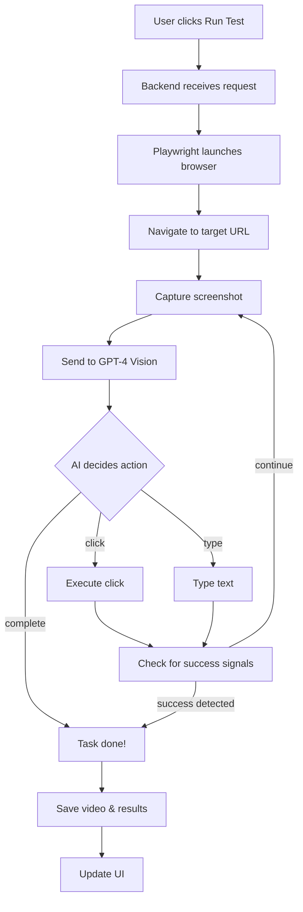

# 🤖 SentinelQA Enterprise

**AI-Powered Autonomous Web Application Testing Platform**

SentinelQA uses GPT-4 Vision to automatically test your web applications by analyzing screenshots and executing actions like a human tester would.

   

---

## 🌟 Features

### Core Features
| Feature | Description |
|---------|-------------|
| **AI-Powered Testing** | GPT-4 Vision analyzes screenshots and decides what actions to take |
| **Natural Language Instructions** | Write tests in plain English: "Click login, enter email, submit form" |
| **Video Recording** | Every test session is recorded and playable in the UI |
| **Smart Completion Detection** | AI detects success messages and URL changes to stop early |
| **GitHub CI/CD Integration** | Auto-run tests on every push or pull request |
| **Multi-Tenant Architecture** | Organizations, projects, and team members |

### AI Capabilities
- 🧠 **Visual Page Analysis** - AI sees screenshots like a human
- 🎯 **Intelligent Action Selection** - Clicks, types, navigates based on context
- ✅ **Success Detection** - Recognizes "success", "sent", "thank you" messages
- 🔄 **URL Change Detection** - Knows when page navigated
- 🛑 **Early Completion** - Stops when task is done (not after 10 steps)

### 🔍 AI-Powered Verification System (NEW!)

SentinelQA doesn't just navigate - it **verifies correctness** with AI-powered dynamic assertions.

#### Verification Types
| Type | What It Checks | Example |
|------|---------------|---------|
| `text_contains` | Element text contains value | "iPhone" in product title |
| `text_equals` | Exact text match | Price = "$999.00" |
| `exists` | Element exists in DOM | Add to cart button exists |
| `visible` | Element is visible on page | Error message is visible |
| `not_visible` | Element NOT visible | Spinner gone, modal closed |
| `enabled` | Button/input is clickable | Submit button is enabled |
| `url_contains` | URL contains pattern | "/checkout" in URL |

#### Confidence Levels
Every verification includes a confidence rating:
- **High** - Direct selector match (most reliable)
- **Medium** - Fallback to text or aria-label
- **Low** - Element not found or unreliable selector

#### Example Output
```
✓ Navigated to https://www.apple.com/
✓ Page title: Apple

Step 1: Click search icon
✓ Executed: click [aria-label*='search' i]

Step 2: Type search term
✓ Executed: type "iPhone 16"
✓ Executed: press Enter

Step 3: Verify search results
  ✓ VERIFY [high]: Search results page loaded
    Result: URL contains '/search/'
  ✓ VERIFY [high]: Product results visible
    Result: Element is visible

📊 Verification Results: 2/2 passed ✓
✓ Task completed successfully
```

#### Failed Verification Example
```
  ✗ VERIFY FAILED [medium]: Price element visible
    Expected: Price visible
    Actual: not visible
    Reason: Element exists but not visible
    Selector: .price-total

📊 Verification Results: 1/2 passed (1 failed)
✗ Task FAILED - Verification failed
```

---

## 🏗️ Architecture

```
┌─────────────────────────────────────────────────────────────┐
│                     Frontend (React)                        │
│  Dashboard │ Projects │ Test Results │ Video Player        │
└─────────────────────────┬───────────────────────────────────┘
                          │ HTTP/REST
┌─────────────────────────▼───────────────────────────────────┐
│                   Backend (FastAPI)                         │
│  Auth │ Projects │ Test Runs │ GitHub Webhooks │ Videos   │
└─────────────────────────┬───────────────────────────────────┘
                          │
        ┌─────────────────┼─────────────────┐
        ▼                 ▼                 ▼
┌──────────────┐  ┌──────────────┐  ┌──────────────┐
│   MongoDB    │  │   OpenAI     │  │  Playwright  │
│  (Database)  │  │  GPT-4 API   │  │  (Browser)   │
└──────────────┘  └──────────────┘  └──────────────┘
```

---

## 🚀 Quick Start

### Prerequisites
- Python 3.10+
- Node.js 18+
- MongoDB (local or Atlas)
- OpenAI API Key

### 1. Clone & Install

```bash
# Clone repository
git clone https://github.com/your-repo/sentinelqa-enterprise.git
cd sentinelqa-enterprise

# Backend setup
cd backend
pip install -r requirements.txt
playwright install chromium

# Frontend setup
cd ../frontend
npm install
```

### 2. Configure Environment

**Backend (`backend/.env`):**
```env
MONGO_URL=mongodb://localhost:27017
DB_NAME=test_database
CORS_ORIGINS=http://localhost:3000
JWT_SECRET=your-secret-key-here
OPENAI_API_KEY=sk-your-openai-api-key
```

**Frontend (`frontend/.env`):**
```env
REACT_APP_BACKEND_URL=http://localhost:8000
```

### 3. Start Services

```bash
# Terminal 1 - Backend
cd backend
python -m uvicorn server:app --port 8000

# Terminal 2 - Frontend
cd frontend
npm start
```

### 4. Access Application
- Frontend: http://localhost:3000
- Backend API: http://localhost:8000

---

## 📖 How It Works

### Test Execution Flow



### AI Decision Process

1. **Screenshot Capture** - Takes screenshot of current page
2. **GPT-4 Vision Analysis** - AI sees the screenshot + HTML context
3. **Action Selection** - AI chooses: click, type, navigate, wait, or complete
4. **Execution** - Playwright performs the action
5. **Success Check** - Detects URL changes or success messages
6. **Loop or Complete** - Continue or finish based on signals

---

## 🔧 API Reference

### Authentication
```http
POST /api/auth/register
POST /api/auth/login
GET  /api/auth/me
```

### Organizations
```http
GET  /api/organizations
POST /api/organizations
GET  /api/organizations/{org_id}
```

### Projects
```http
GET  /api/organizations/{org_id}/projects
POST /api/organizations/{org_id}/projects
GET  /api/organizations/{org_id}/projects/{project_id}
POST /api/organizations/{org_id}/projects/{project_id}/run
```

### GitHub Webhooks
```http
POST /api/webhooks/github/{project_id}
```

### Videos
```http
GET /videos/{filename}.webm
```

---

## 🔗 GitHub Integration

### Setup Webhook

1. **In SentinelQA:** Configure project with:
   - `github_repo`: `owner/repository`
   - `github_token`: Personal access token (repo:status scope)
   - `github_webhook_secret`: Random secret string

2. **In GitHub:** Go to repo Settings → Webhooks → Add webhook:
   - **Payload URL:** `https://your-domain/api/webhooks/github/{project_id}`
   - **Content type:** application/json
   - **Secret:** Same as `github_webhook_secret`
   - **Events:** Push, Pull requests

### What Happens

| Event | Action |
|-------|--------|
| Push to main/master | Test runs automatically |
| PR opened | Test runs on PR head |
| New PR commits | Test re-runs |
| Test completes | Commit status updated ✓/✗ |

---

## 📂 Project Structure

```
sentinelqa-enterprise/
├── backend/
│   ├── server.py          # FastAPI application
│   ├── worker.py          # AI worker with Playwright
│   ├── requirements.txt   # Python dependencies
│   ├── .env              # Environment variables
│   └── videos/           # Recorded test videos
│
├── frontend/
│   ├── src/
│   │   ├── pages/        # React pages
│   │   ├── components/   # UI components
│   │   └── context/      # Auth context
│   ├── package.json
│   └── .env
│
└── README.md
```

---

## 🛡️ Security Features

- **JWT Authentication** - Secure token-based auth
- **Password Hashing** - bcrypt encryption
- **CORS Protection** - Configurable origins
- **Webhook Signatures** - HMAC-SHA256 verification
- **Path Sanitization** - Prevents directory traversal
- **Input Validation** - Pydantic models

---

## ⚡ Performance

| Metric | Value |
|--------|-------|
| Avg test duration | 20-40 seconds |
| AI steps per test | 3-5 (smart completion) |
| Video file size | 1-3 MB |
| API cost per test | ~$0.01-0.02 |

---

## 🔮 Roadmap

- [ ] Scheduled tests (daily/weekly cron)
- [ ] Email notifications on failure
- [ ] Slack/Discord webhooks
- [ ] Visual regression testing
- [ ] Parallel test execution
- [ ] Cloud deployment (Docker)
- [ ] Test suite management
- [ ] Performance monitoring

---

## 🐛 Troubleshooting

### MongoDB Connection Failed
```bash
# Start MongoDB service (Windows)
net start MongoDB

# Or install MongoDB Community Server
# https://www.mongodb.com/try/download/community
```

### OpenAI API Error
```bash
# Check API key is set
python -c "import os; print(os.getenv('OPENAI_API_KEY')[:10])"
```

### Port Already in Use
```powershell
# Kill existing processes
taskkill /F /IM python.exe
```

### CORS Errors
- Check `CORS_ORIGINS` in backend `.env`
- Must include frontend URL: `http://localhost:3000`

---

## 📄 License

MIT License - See [LICENSE](LICENSE) for details.

---

## 🤝 Contributing

1. Fork the repository
2. Create feature branch (`git checkout -b feature/amazing`)
3. Commit changes (`git commit -m 'Add amazing feature'`)
4. Push to branch (`git push origin feature/amazing`)
5. Open Pull Request

---

## 📞 Support

- **Issues:** [GitHub Issues](https://github.com/your-repo/sentinelqa/issues)
- **Email:** support@sentinelqa.com

---

**Built with ❤️ using GPT-4 Vision, Playwright, FastAPI, and React**
